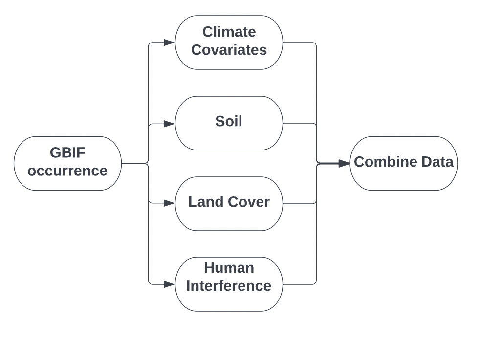
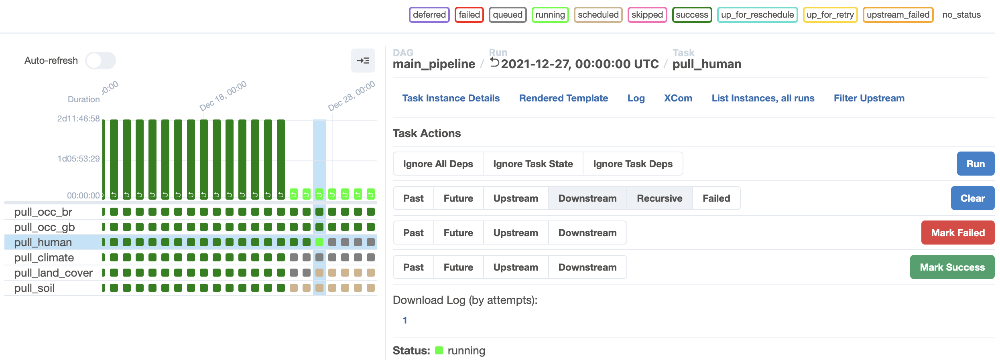
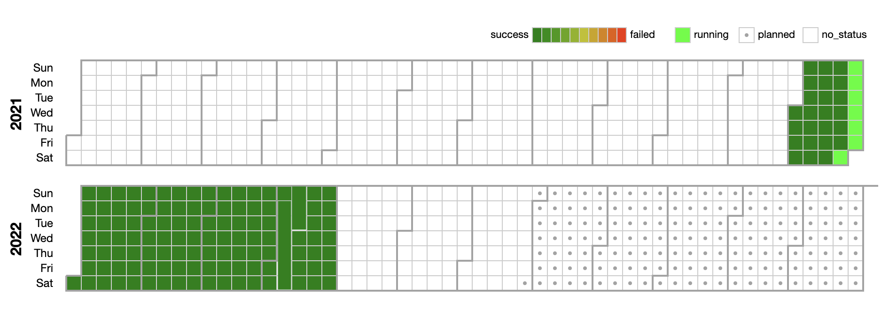

# 🐾 GBIF powered by covariates
> &#x20;🐸 Open-access biodiversity data

# Documentation and Caveats

This document serves to explain the assumptions and design decisions that brought forward this product. The document is organized as follows:

- Objective
- Data Sources and decisions
- Data Pipeline and Automation
- User Experience
- ✨Future Work

# Objective

Our product seeks to extend the GBIF occurrences with other crucial environmental and human interference data that are currently available through disparate sources. We expect our proposal to save time for ecologists (& environmental data researchers) by automating the laborious data engineering phase.

Our aim is to make GBIF more comprehensive and quicker to adopt by incorporating the following tenets.

> *Access - Improve accessibility to environmental data science by reducing time/programming/data engineering barriers\
> Usefulness -  Integrate data sources that are valuable to the community\
> Quality of open biodiversity data - Create an iterative mechanism to improve data quality and clear documentation and usage instructions.*

Next, we describe the various data sources that are currently available in the pipeline.

# Data Sources and Decisions

Our proof of concept currently contains two countries, Brazil and United Kingdom, and about 6 months of combined data. Our pipeline, described in [detail below](#data-pipeline-and-automation), can be fired up to run for all the available countries on GBIF and can also be backfilled for as many years as the various data sources are available for. Once backfilled, the idea is to run our backend orchestrator on a daily schedule. Our priority is to integrate our backend with GBIF ([Read more](#future-work)). 

## Climate

NOAA

Climate variables like temperature, precipitation, pressure are crucial to any sort of biodiversity modeling. 
Climate variables can be analyzed to find impact of drastic climate events or long term global warming effects on our biodiversity populations as well as migratory patterns. We use data provided by the [National Oceanic and Atmospheric Administration (NOAA)](https://www.noaa.gov/) due to it's quality, coverage, and popular adoption.

The following variables are currently included in our database.

| **Code** | **Meaning**             |
| -------- | ----------------------- |
| TAVG     | Average Temperature     |
| TMIN     | Minimum Temperature     |
| TMAX     | Maximum Temperature     |
| PRCP     | Total Precipitation     |
| WDIR     | Wind (From) Direction   |
| WSPD     | Average Wind Speed      |
| WPGT     | Wind Peak Gust          |
| RHUM     | Relative Humidity       |
| PRES     | Sea-Level Air Pressure  |
| SNOW     | Snow Depth              |
| TSUN     | Total Sunshine Duration |

## Soil

Soil characteristics in a region are linked to vegetation and plant life and influence the ecosystem. Soil properties can be used as an important feature in techniques like Species Distribution modeling (SDM) as similar biodiversity can be expected in areas with similar physical and chemical soil profile.

We source our soil profiles from [**SoilGrids 250m resolution data**](https://www.isric.org/explore/soilgrids)

### Properties

The table below shows the properties currently mapped with SoilGrids, their description and mapped units. By dividing the predictions values by the values in the *Conversion factor* column, the user can obtain the more familiar units in the *Conventional units* column.

| **Name**     | **Description**                                                                        | **Mapped units**   | **Conversion factor** | **Conventional units** |
| ------------ | -------------------------------------------------------------------------------------- | ------------------ | --------------------- | ---------------------- |
| **bdod**     | **Bulk density of the fine earth fraction**                                            | **cg/cm³**         | **100**               | **kg/dm³**             |
| **cec**      | **Cation Exchange Capacity of the soil**                                               | **mmol(c)/kg**     | **10**                | **cmol(c)/kg**         |
| **cfvo**     | **Volumetric fraction of coarse fragments (> 2 mm)**                                   | **cm3/dm3 (vol‰)** | **10**                | **cm3/100cm3 (vol%)**  |
| **clay**     | **Proportion of clay particles (< 0.002 mm) in the fine earth fraction**               | **g/kg**           | **10**                | **g/100g (%)**         |
| **nitrogen** | **Total nitrogen (N)**                                                                 | **cg/kg**          | **100**               | **g/kg**               |
| **phh2o**    | **Soil pH**                                                                            | **pHx10**          | **10**                | **pH**                 |
| **sand**     | **Proportion of sand particles (> 0.05 mm) in the fine earth fraction**                | **g/kg**           | **10**                | **g/100g (%)**         |
| **silt**     | **Proportion of silt particles (≥ 0.002 mm and ≤ 0.05 mm) in the fine earth fraction** | **g/kg**           | **10**                | **g/100g (%)**         |
| **soc**      | **Soil organic carbon content in the fine earth fraction**                             | **dg/kg**          | **10**                | **g/kg**               |
| **ocd**      | **Organic carbon density**                                                             | **hg/m³**          | **10**                | **kg/m³**              |
| **ocs**      | **Organic carbon stocks**                                                              | **t/ha**           | **10**                | **kg/m²**              |

### Depth intervals

**SoilGrids predictions are made for the six standard depth intervals specified in the** [**GlobalSoilMap IUSS working group and its specifications**](https://www.isric.org/sites/default/files/GlobalSoilMap_specifications_december_2015_2.pdf)**:**

|                        | **Interval I** | **Interval II** | **Interval III** | **Interval IV** | **Interval V** | **Interval VI** |
| ---------------------- | -------------- | --------------- | ---------------- | --------------- | -------------- | --------------- |
| ***Top depth (cm)***   | **0**          | **5**           | **15**           | **30**          | **60**         | **100**         |
| ***Bottom depth (cm*** | **5**          | **15**          | **30**           | **60**          | **100**        | **200**         |

###

We use the 0-5cm mean depth for creating the soil profile. A bounding box of 1000m around the occurrence location is used to compute the mean value of the soil variable in that region. This accounts for resolution difference and errors in exact latitude and longitude of the reported GBIF occurrence.


## Land Cover

Land cover refers to the physical terrian of a location. Land cover labels can help ecologists quickly conceptualize the physical environment around an occurrence. For getting land cover labels, we use [**Google's Dynamic World**](https://developers.google.com/earth-engine/datasets/catalog/GOOGLE_DYNAMICWORLD_V1) which has a spatial resolution of 10m.

### Land Cover Labels

The dynamic world dataset contains near real-time (NRT) land use land cover (LULC) predictions created from Sentinel-2 imagery for nine land use land cover (LULC) classes as described in the table below.

| Name              |  Description
| -----------       | ----------------------------
| Water             | Permanent and seasonal water bodies
| Trees             | Includes primary and secondary forests, as well as large-scale plantations
| Grass             | Natural grasslands, livestock pastures, and parks
| Flooded Vegetation| Mangroves and other inundated ecosystems
| Crops             | Include row crops and paddy crops
| Shrub and Scrub   | Sparse to dense open vegetation consisting of shrubs
| Built             | Low- and high-density buildings, roads, and urban open space
| Bare              | Deserts and exposed rock
| Snow and Ice      | Permanent and seasonal snow cover
| Label             | Index of the band with the highest estimated probability of above labels

We use a bounding box of 1000m (side length) to grab the dynamic world imagery for a particular location. and The mode of the available land cover labels is used as the representative land cover of the bounding box region. This is to account for spatial resolution of the data and potential errors in GBIF's occurence data latitude and longitude values.


## Human Interference

### Light Pollution

Light pollution is a major disturbance to biodiversity, including insects and migratory birds. As habitats shrink, more artificial lights seep into the natural world during the night. We use the data from the "Open night time lights" project by the world bank. The data is captured by the VIIRS (Visible Infrared Imaging Radiometer Suite) satellite.&#x20;

The DNB (day night band) are scanning radiometers capable of low-light imaging and are launched onboard sun-synchronous polar-orbiting platforms. They both collect 14 orbits per day, imaging the daytime and nighttime side of the earth every 24 hours at a 750 m (on an edge) spatial resolution.

Daily data has too much noise to provide meaningful numbers. It is common practice to use monthly or annual composite satellite data to get a sense of the light distribution at a point.

We use [VIIRS stray light corrected DNB monthly composites](https://developers.google.com/earth-engine/datasets/catalog/NOAA_VIIRS_DNB_MONTHLY_V1_VCMSLCFG "VIIRS Stray Light Corrected Nighttime Day/Night Band Composites Version 1 | Earth Engine Data Catalog | Google Developers") data to determine the potential radiance exposure of a GBIF occurrence location. We provide the data using a **20km** radius buffer zone and compute the **average radiance** in the region (assumption: Animal location is not exact and moves around over time, in this case, from day to night if spotted during the day)

**Average radiance range (approximate) and units:  0-300 nanowatts/cm2/sr** (higher being more radiance, avg\_radiance)

### Invasive Species

Invasive species can pose a major threat to the native biodiversity of a land. We flag each GBIF occurrence in a particular location as invasive or not. This signal works as an early indicator of invasive species growth and can drive action to curb the spread. &#x20;

We use the Global invasive species dataset by IUCN

```
Number of rows for sample used:
 GBR    437
 BRA    388
```

The output is a boolean value corresponding to each occurrence (is\_invasive).&#x20;

*Caveat:* We use the global invasive species dataset that does not seem to update very frequently and does not have intra-country invasiveness data. We will replace the main source of this signal if a better option surfaces.

### Human Settlement

Human settlement data can provide information about proximity to urban centers. Such data can be important to understand which areas overlap with significant biodiversity and should be preserved.

Our human settlement data comes from 'The Global Human Settlement Layer (GHSL)' dataset (Latest data: 2015, our database will be updated when there is a new census).

This data can also serve as a proxy for roadways.&#x20;

We provide the data using a **10km** radius buffer zone and compute the **average degree of urbanization** in the region.

Degree of urbanization is quantified on a scale of 0-3:

- Uninhabited areas - 0
- Rural grid cells - 1
- Low Density Clusters (towns and cities) - 2&#x20;
- High Density Clusters (cities) - 3

We provide an average degree of urbanization of a 10km radius zone as 'avg\_deg\_urban'.

*Caveat*: If a lot of occurrence data comes from citizen science, there is an inherent bias in the occurrence data.  As the occurrences will be more heavily reported around urban centers. We need to calculate populations with this bias in mind.

# Data Pipeline and Automation

Biodiversity and environmental data are increasing at an exponential scale and will continue to do so. We need to build scalable and robust pipelines and code to handle data that is constantly updated. For our project, we orchestrate our pipeline using Apache Airflow.

[Apache airflow](https://airflow.apache.org/) is a data orchestration tool to schedule jobs and maintain scalable pipelines. We chose airflow because it is free and open source. it also integrates well with different cloud platforms and has the largest user support community.

Our pipeline fetches daily data from the GBIF API. The next steps are parallel data fetching and integration of our varied data sources (modular and can be easily extended to include more sources/eliminate unimportant ones) corresponding the GBIF temporal and spatial data. Our final step is to combine all the sources which can be queried by our visualization website or the end user.&#x20;



The figure below demonstrates our pipeline run for a select number of days. The pipeline will be set to run on a daily schedule and past data can be backfilled once all the parameters are finalized and the pipeline is moved to the cloud.&#x20;

<br>





# Website

We host a website at: <br>
This website helps to visualize the data we are storing in the backend. The user can query, interact, and download the backend data through this simple to use interface. 

# Future Work

* Since our goal is to enhance GBIF's capabilies and adoption rate, our next steps will be to find the most optimal way to integrate our modular project with GBIF. As of now we foresee 3 options (listed in descending order of priority):
    1. We integrate our module with the backend available at GBIF by providing engineering support during the integration.
    2. We provide the code as a package (R,Python) that can be integrated into an individual user's codebase.
    3. We host the pipeline as GBIF's complementary entity and populate the backend to be queries by the users.
* Extend prototype for all countries (Present prototype is only for Brazil and the Great Britain)
* We plan to incorporate additional variable requests that can help with biodiversity modeling
* We will also update variables like buffer zone radius, bounding box size if evidence for better thresholds is provided.


## Resources

1. [NOAA](https://www.noaa.gov/)
2. [SoilGrids — global gridded soil information](https://www.isric.org/explore/soilgrids/ "SoilGrids — global gridded soil information")
3. [Google Dynamic World - Land Cover](https://developers.google.com/earth-engine/datasets/catalog/GOOGLE_DYNAMICWORLD_V1 "Dynamic World V1 | Earth Engine Data Catalog | Google Developers")
4. [Welcome — Open Nighttime Lights](https://worldbank.github.io/OpenNightLights/welcome.html "Welcome — Open Nighttime Lights")
5. [Global Invasive Species Database](https://www.gbif.org/dataset/b351a324-77c4-41c9-a909-f30f77268bc4 "Global Invasive Species Database")
6. [Global Human Settlement - GHSL Homepage - European Commission](https://ghsl.jrc.ec.europa.eu/ "Global Human Settlement - GHSL Homepage - European Commission")

## Code

[Github Code Repository ](https://github.com/tekritesh/bio-conservation "GitHub - tekritesh/bio-conservation")


## License

MIT
